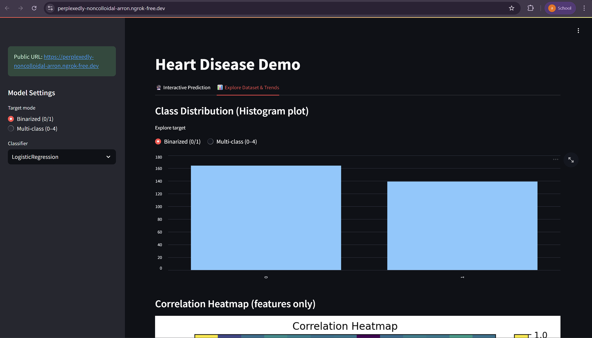
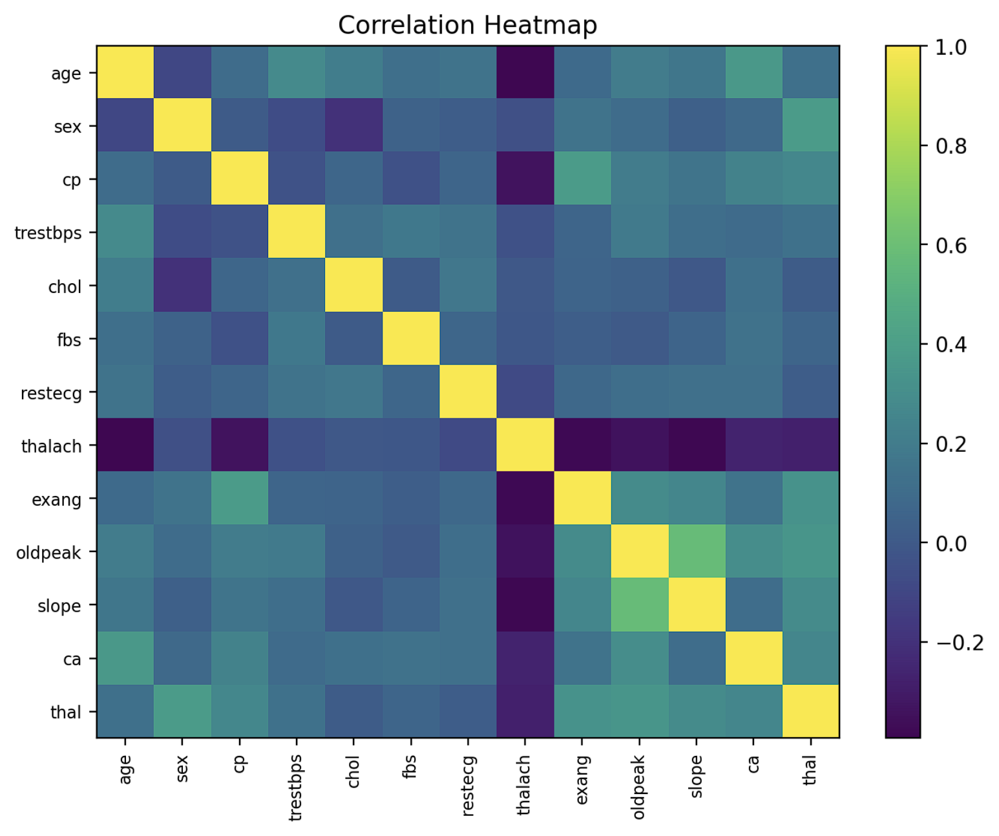
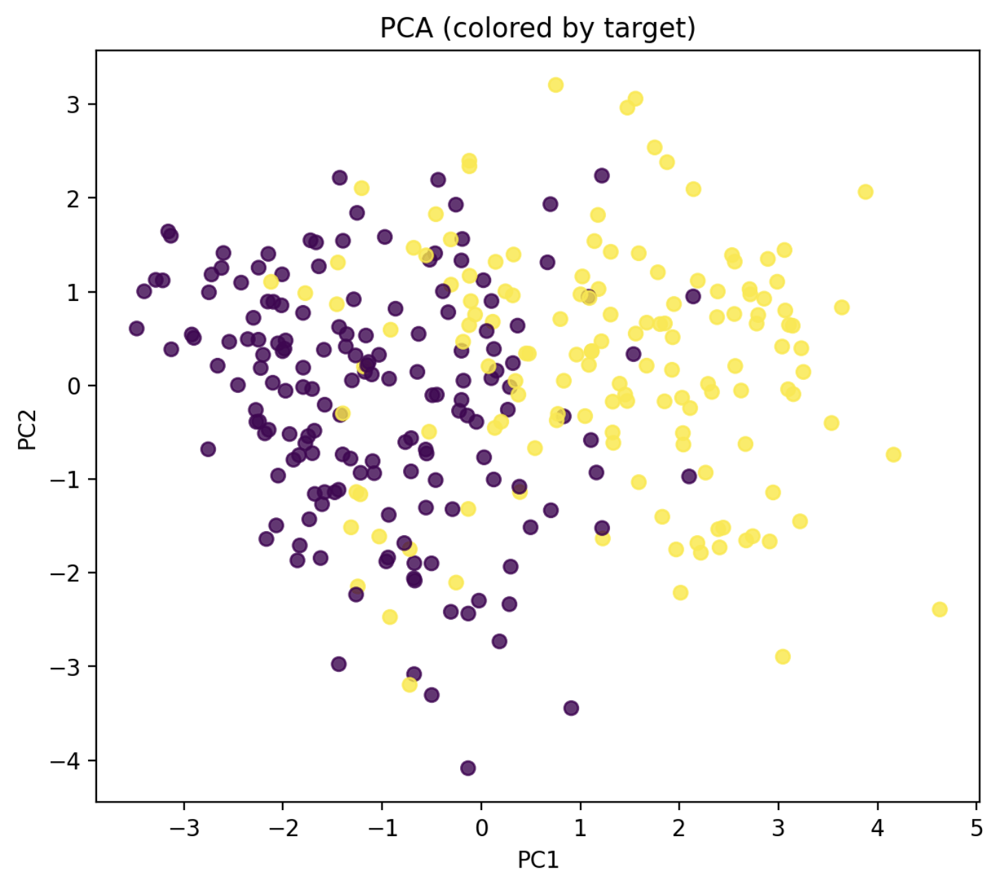
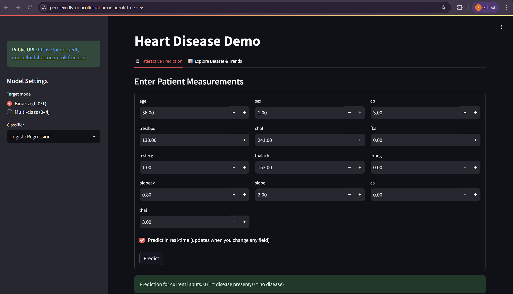
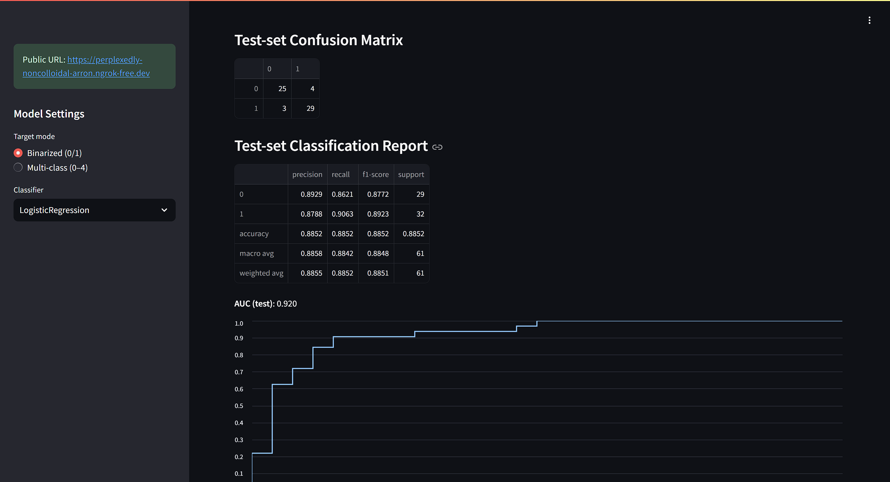
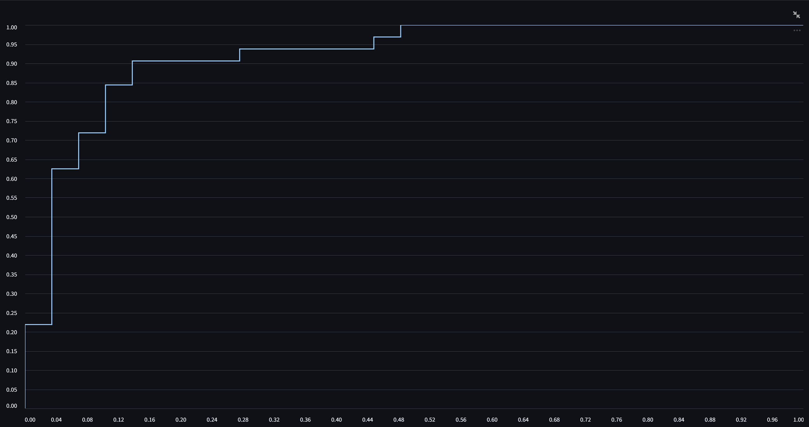

# Comprehensive Machine Learning Pipeline on UCI Heart Disease Dataset

[]()
[]()
[]()

A full end-to-end machine learning project for the **UCI Heart Disease dataset**.

## Table of Contents
1. [Project Overview](#project-overview)
2. [Repository structure](#repository-structure)
3. [Dataset](#dataset)
4. [Installation](#installation)
5. [Operation](#repository-structure)
6. [Deployment](#repository-structure)
7. [Project demo](#repository-structure)
8. [Acknowledgements](#repository-structure)
9. [Repository structure](#repository-structure)
10. [Repository structure](#repository-structure)


## Introduction
This project is a machine learning project aimed towards patients that are under the suspecion of having a heart disease, and under supervision of a doctor. It shall detect whether a patient has a heart disease, based on some medical data such as:
+ Cholestrol level                             (chol)
+ Resting blood pressure                       (trestbps)
+ Chest pain                                   (cp)
+ Maxiumum heart rate achieved during exercise (thalach)
+ Fasting blood sugar                          (fbs)
+ Exercise induced angina                      (exang)

And even more.

> [!CAUTION]
> This project in no way, shape or form acts as an alternative to doctors. This project is merely for doctors to help them with their process. If you are a patient, please avoid self-diagnosis and consult a doctor.

## Project Overview
- Preprocessing: Data loading & cleaning.
- Feature Engineering: feature selection (Chi², RFE, importance scores), PCA.
- Supervised Learning: Logistic Regression, Decision Trees, Random Forest, SVM, etc.
- Unsupervised Learning: K-Means, Hierarchical clustering.
- Hyperparameter Tuning: GridSearchCV & RandomizedSearchCV.
- Evaluation: Confusion matrices, ROC/AUC, classification reports.
- Deployment: Streamlit-based UI with ngrok tunneling.

---

## Repository structure
.
├─ data/
│  └─ heart_disease.csv
├─ deployment/  
│  ngrok_setup.txt                  
├─ models/
│  ├─ heart_disease_binarized_model.pkl
│  └─ heart_disease_model.pkl
├─ notebooks/
│  ├─   config.py                
│  ├─ data_preprocessing.py      
│  ├─ pca_analysis.py            
│  ├─ feature_selection.py       
│  ├─ supervised_learning.py     
│  ├─ unsupervised_learning.py   
│  ├─ hyperparameter_tuning.py   
│  ├─ post_train_visualization.py
|  ├─ pipeline_runner.py         
├─ results/
│  ├─ best_binarized_model_results.txt
│  └─ best_model_results.txt
├─ ui/
│  └─ app.py  
├─ .gitignore
├─ README.md
├─ \_\_init.py\_\_
├─ main.ipynb             
├─ requirements.txt

## Dataset
- Source: <ins>[UCI Heart Disease Dataset]</ins>(https://archive.ics.uci.edu/dataset/45/heart+disease)

- Target variable:
    + Values ranging from <font color="green">**0**</font> to <font color="red">**4**</font> representing classes, with each class corresponding to the **existence** or **absence** of heart disease and its **severity**.

## Installation
<!-- Create & activate virtual environment -->
```
conda create virtual_env_name
conda activate virtual_env_name
```

<!-- Install dependencies -->
```
pip install -r requirements.txt
```

> [!IMPORTANT]
> This project was made by Python 3.12.7, Please make sure you use v3.12.7 or above for optimal compatibility.

## Operation
<!-- Run main.ipynb -->

> [!NOTE]
> If you wish to change parameters, values, datasets, or visulization modes, you can visit **__pipeline_runner.py__** or **__config.py__**.


## Deployment
<!-- Run app.py -->
```
streamlit run ui/app.py
```

> [!WARNING]
> Avoid stopping the app while it is running as it will cause the web server to shut down.

## Project demo












## Acknowledgements
- [UCI Machine Learning Repository](https://archive.ics.uci.edu/)

- UCI Heart Disease dataset contributors:
    1. [Andras Janosi](https://www.semanticscholar.org/author/A.-J%C3%A1nosi/6084925)
    2. [William Steinbrunn](https://www.semanticscholar.org/author/W.-Steinbrunn/7761429)
    3. [Matthias Pfisterer](https://www.semanticscholar.org/author/M.-Pfisterer/38881881)
    4. [Robert Detrano](https://www.semanticscholar.org/author/R.-Detrano/4862920)

- Libraries: 
    1. [numpy](https://numpy.org/)      
    2. [scipy](https://scipy.org/)      
    3. [pandas](https://pandas.pydata.org/)      
    4. [ucimlrepo](https://github.com/uci-ml-repo/ucimlrepo)   
    5. [matplotlib](https://matplotlib.org/)   
    6. [seaborn](https://seaborn.pydata.org/)    
    7. [sklearn](https://scikit-learn.org/stable/)      
    8. [streamlit](https://streamlit.io/)   
    9. [pyngrok](https://pypi.org/project/pyngrok/)

- Package managers:
    1. [pip](https://pypi.org/project/pip/)
    2. [anaconda](https://www.anaconda.com/)